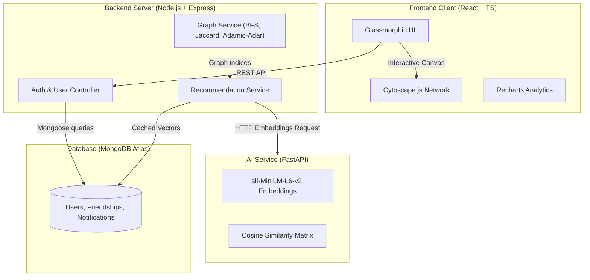

# GraphMate — AI-Powered Friend Recommendation & Network Visualization Platform

GraphMate is a premium full-stack social networking system that blends traditional graph-theoretic models with state-of-the-art Natural Language Processing (NLP) to recommend connections. The system features a beautiful glassmorphic dark/light UI, interactive network graphs, semantic search, and explains matching decisions with complete transparency.

---

## Technical Stack & Architecture

GraphMate is designed with a scalable, modern microservice architecture:

- **Frontend**: React, TypeScript, Tailwind CSS v4, Framer Motion, Cytoscape.js, Recharts
- **Backend Service**: Node.js, Express.js, TypeScript, MongoDB, Mongoose
- **AI Microservice**: Python, FastAPI, NumPy, Sentence Transformers (`all-MiniLM-L6-v2`)



---

## Core Algorithmic Breakdown

GraphMate computes connection recommendation scores using a hybrid weighting pipeline:

$$\text{Final Score} = (0.6 \times \text{Graph Score}) + (0.4 \times \text{AI Similarity Score})$$

### 1. The Graph Score (60% Weight)
The graph-theoretic score is computed based on adjacency parameters:
- **BFS Depth-2 traversal**: Identifies friends-of-friends connections.
- **Jaccard Similarity Index**: Measures mutual connections overlap relative to total friends.
- **Adamic-Adar Index**: Assigns higher importance to mutual friends who are less connected overall.
- **College & Location Matching**: Grants bonus points for institutional and regional overlap.

### 2. The AI Similarity Score (40% Weight)
- User profiles (bio, skills, and interests) are converted to a text document.
- The Python AI microservice converts documents into 384-dimensional vectors using `all-MiniLM-L6-v2`.
- Cosine similarity is computed between user vectors using vectorized NumPy matrix multiplications.

---

## Directory Structure

```
FRS/
├── client/                 # React + Vite + TS Frontend
├── server/                 # Node.js + Express + TS Backend
├── ai-service/             # Python FastAPI AI Microservice
├── docs/                   # Full API & Architectural Docs
├── seed/                   # Database seed assets
├── README.md
└── package.json            # Global scripts
```

---

## Quick Start Guide

### Prerequisites
- Node.js v18+
- Python 3.9+
- MongoDB instance (local or Atlas)

### Setup & Installation

1. **Clone & Install Base Dependencies**:
   ```bash
   npm run install:all
   ```

2. **Configure Environment Variables**:
   Copy `.env.example` to `server/.env` and update your variables:
   ```bash
   cp .env.example server/.env
   ```

3. **Install Python AI Service Dependencies**:
   ```bash
   cd ai-service
   pip install -r requirements.txt
   ```

4. **Launch All Services Concurrently**:
   Run the root workspace dev command:
   ```bash
   npm run dev
   ```
   This will concurrently spin up the React client (`http://localhost:5173`), the Node.js server (`http://localhost:5000`), and the FastAPI microservice (`http://localhost:8000`).

5. **Seed Demo Data (Optional)**:
   Populate the database with 75 realistic profiles, established friendships, and vectors:
   ```bash
   npm run seed
   ```

---

## API Documentation Summary

| Endpoint | Method | Service | Description | Auth Required |
|---|---|---|---|---|
| `/api/auth/register` | `POST` | Backend | Register a new user | No |
| `/api/auth/login` | `POST` | Backend | Authenticate user & return JWT | No |
| `/api/recommendations` | `GET` | Backend | Get top 10 hybrid matching suggestions | Yes |
| `/api/graph/network` | `GET` | Backend | Get Cytoscape nodes and edge weights | Yes |
| `/api/search` | `GET` | Backend | Search profiles with metadata filters or AI Semantic query | Yes |
| `/api/embed` | `POST` | AI Service | Generate text document embedding | No |
| `/api/similarity` | `POST` | AI Service | Compute cosine similarity between vectors | No |

*For full API documentation, refer to [docs/api-docs.md](file:///c:/Users/ACER/OneDrive/Desktop/Work/FRS/docs/api-docs.md).*
